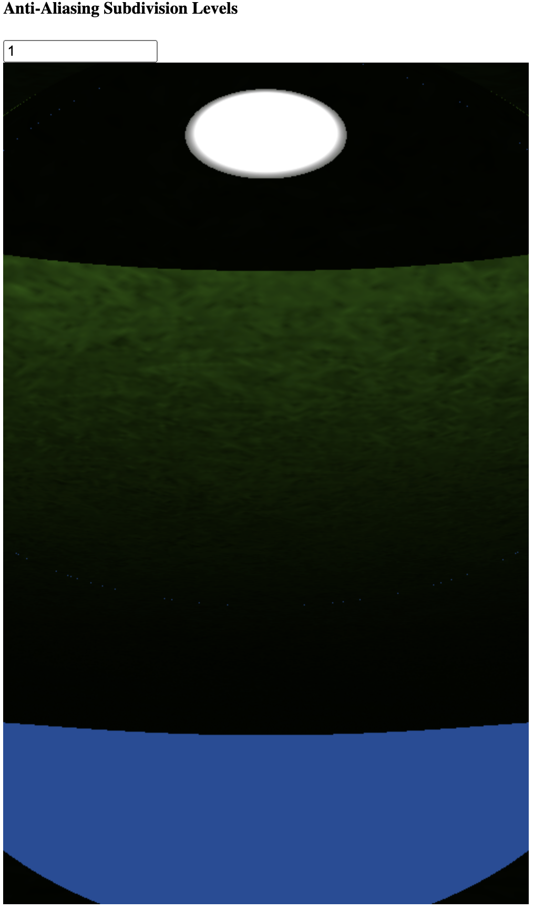
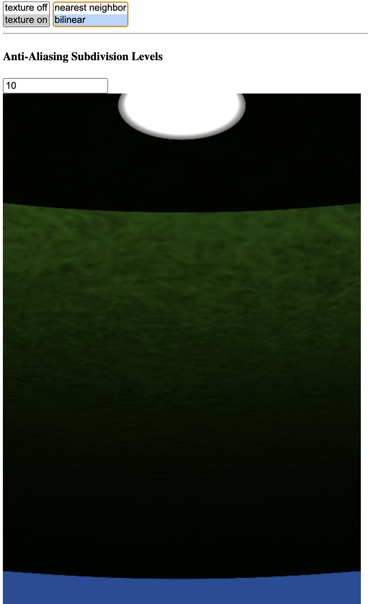
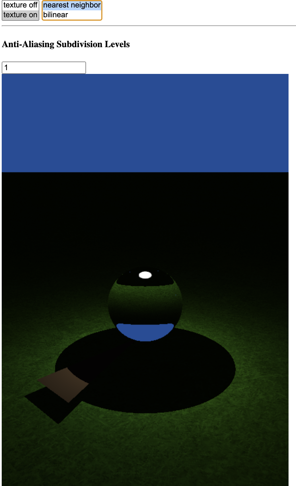

# Worksheet 3 part 4
Overall, as the number of subpixel samples increases, sharp edges become less jagged. For example, the sharp shadow around the ball has visibly jagged edges with subpixels = 1, but with subsample antialiasing these edges smooth out. The difference is especially noticable when zoomed  in closely to the edge (by adjusting the camera constant).
For example:

## Scaling factor = 0.2
### Zoomed in
#### Nearest Neighbor
With nearest neighbor filtering, the texture appears "sharper" but individual pixels in the original texture are more evident. This is especially highlighted when individual texels take up many pixels in the final render. For example, when looking at the top of the sphere in refractive shader mode, the ground directly below the ball is magnified by the sphere acting as a lens. This allows the texels to be made out clearly even with the scaling factor of 0.2.

#### Bilinear
When rendering with bilinear texture filtering instead, the edges of individual texels are less clear, and the overall image is smoother. There is no additional information, as the texture is so enlarged that individual texels still cover many pixels in the render, but the bilinear filtering makes the transition between adjacent texels less apparent by blurring between them.

In both cases, because we are looking at texels covering many pixels, the sub-pixel antialiasing doesn't matter much except for making the sharp edges between texels rendered in nearest neighbor mode look less jagged.
### Zoomed out
When zoomed out, the higher sharpness of nearest neighbor filtering makes the grass appear slightly more textured, but the difference is slight. 
#### Nearest Neighbor

#### Bilinear

## Scaling factor = 0.02
With the scale factor reduced by a factor of 10, individual texels of the grass texture now take up large portions of the render. With bilinear filtering this results in a very blurry image, and wiht nearest neighbor filtering it results in large obvious square texels.
### Nearest Neighbor

### Bilinear
